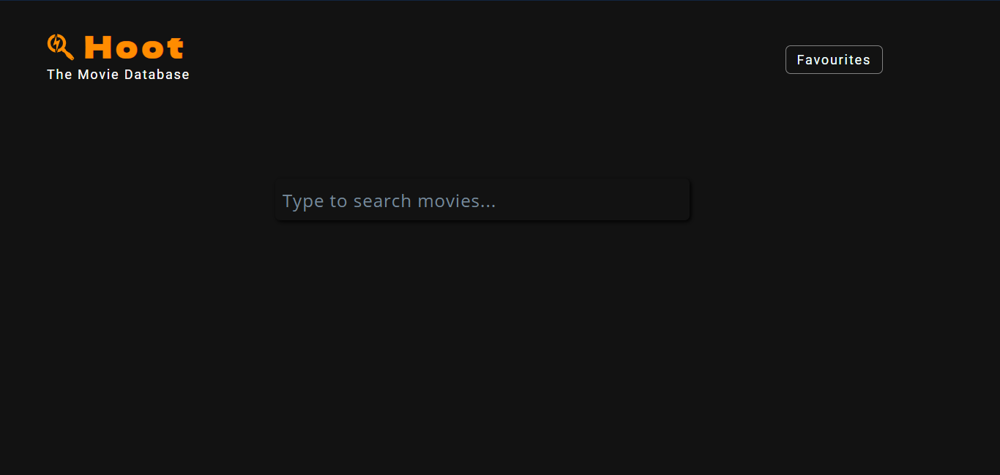
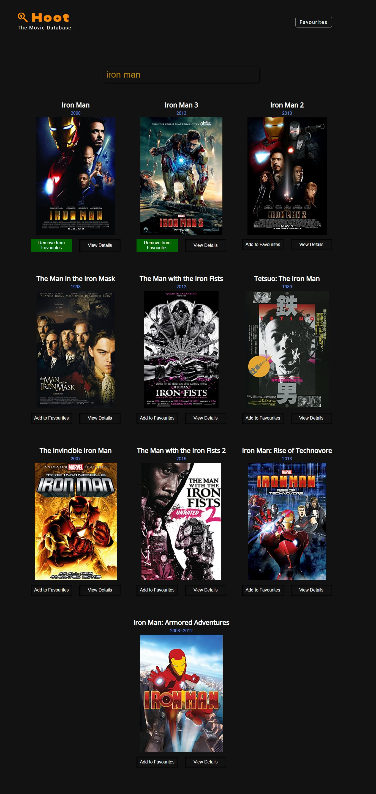
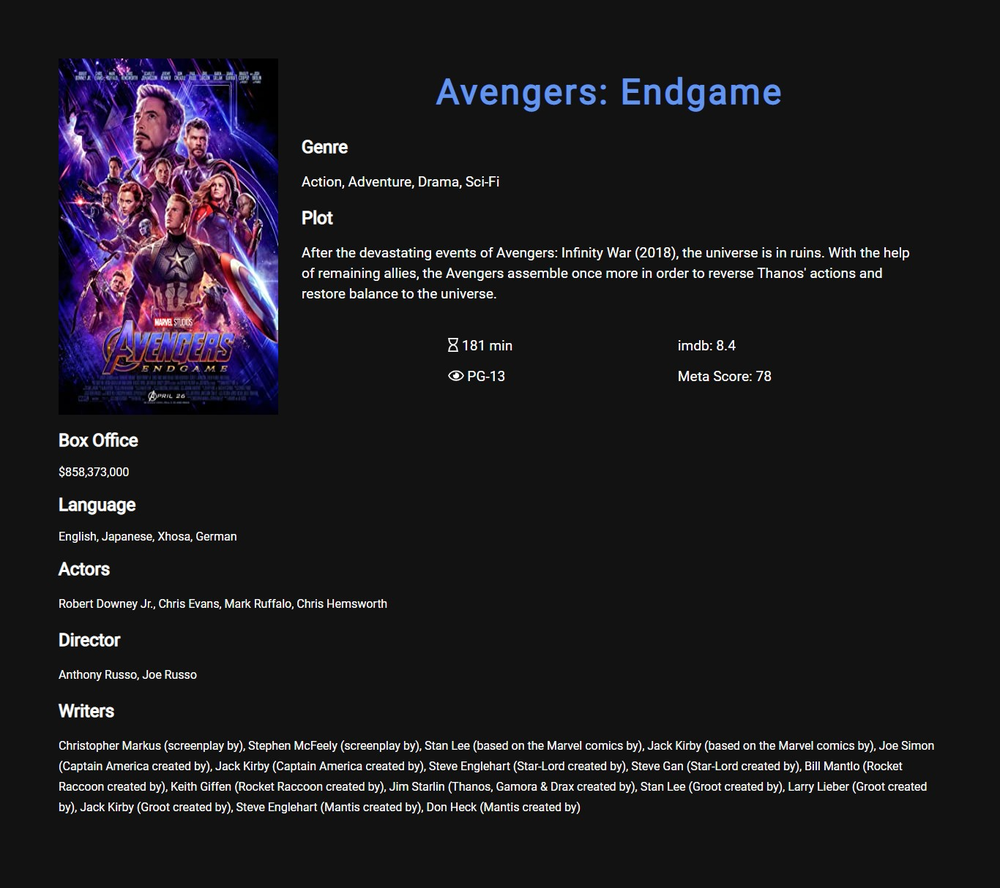

# hoot
A movie search app using OMDb API made with vanilla javascript.
### Live Demo: (https://prashwarmishra.github.io/hoot/)
### Screenshots:
- Home page in Idle State:

- Home page when a movie name is searched:

- Favourites page:

- Movie Details page, which open when view-more button is clicked:

